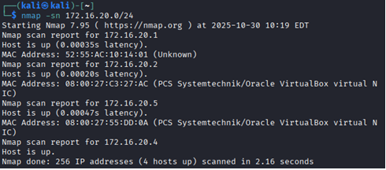
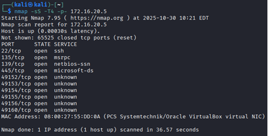
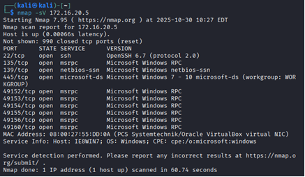
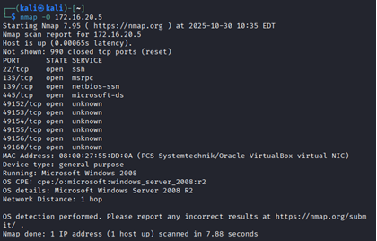
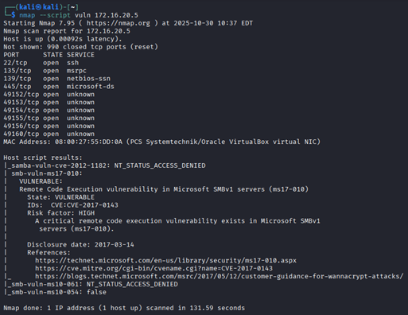

# 🛡️ Primeros pasos en Ciberseguridad

**Análisis de vulnerabilidades con Nmap usando Kali Linux y una Máquina Virtual Windows**

---

### 👨‍💻 Autor

- **Pablo Amion**

**Carrera:** Ingeniería Informática\
**Asignatura:** Seguridad de la Información\
**Fecha:** 30-10-2025

---

## 🧩 Introducción

Este proyecto documenta un **análisis de vulnerabilidades** realizado en un entorno de laboratorio controlado.\
Se utilizó **Kali Linux** como sistema atacante y una **máquina virtual Windows** como objetivo dentro de una red privada.

La empresa ficticia **TechNova S.A.**, dedicada al desarrollo de software, presenta posibles debilidades de seguridad debido al uso de un sistema operativo fuera de soporte.

El propósito fue identificar y clasificar vulnerabilidades mediante la herramienta **Nmap**, evaluando su nivel de riesgo según la probabilidad de explotación e impacto potencial.

---

## ⚙️ Resumen Ejecutivo

Se analizó un host **Windows (IP 172.16.20.5)** desde una máquina **Kali Linux (IP 172.16.20.4)** utilizando **Nmap**.\
El objetivo fue identificar **puertos abiertos, servicios activos y vulnerabilidades explotables**.

🔎 **Hallazgos principales:**

- Presencia de **SMBv1 vulnerable (MS17-010)** → riesgo crítico (EternalBlue / WannaCry).
- Sistema operativo **Windows Server 2008 R2 / Windows 7-like** (fuera de soporte).
- Exposición de **puertos MSRPC y SSH antiguos**.

🧭 **Acciones propuestas:**\
Aplicación de parches, políticas de actualización, segmentación de red y controles IDS/IPS para detección temprana.

---

## 🧰 Metodología


El análisis siguió el ciclo básico de una auditoría técnica con Nmap:

```bash
# 1️⃣ Descubrimiento de hosts
nmap -sn 172.16.20.0/24

# 2️⃣ Escaneo de puertos TCP
nmap -sS -T4 -p- 172.16.20.5

# 3️⃣ Detección de servicios y versiones
nmap -sV 172.16.20.5

# 4️⃣ Detección de sistema operativo
nmap -O 172.16.20.5

# 5️⃣ Escaneo de vulnerabilidades
nmap --script vuln 172.16.20.5
```

---

## 🔍 Resultados escaneo con Nmap

### 1) Descubrimiento de hosts

```bash
nmap -sn 172.16.20.0/24
```

**Descripción:** Ejecuta un ping scan (host discovery) sobre la subred para identificar máquinas activas sin escanear puertos.




---

### 2) Escaneo de puertos TCP (todos los puertos)

```bash
nmap -sS -T4 -p- 172.16.20.5
```

**Descripción:** SYN scan rápido de todos los puertos TCP para detectar cuáles están abiertos.



---

### 3) Detección de servicios y versiones

```bash
nmap -sV 172.16.20.5
```

**Descripción:** Interroga los puertos abiertos para identificar el servicio y la versión que ejecuta cada puerto (p. ej. OpenSSH 6.7, Samba, etc.).



---

### 4) Detección de sistema operativo

```bash
nmap -O 172.16.20.5
```

**Descripción:** Intenta determinar el sistema operativo remoto mediante huellas TTL, puertos y respuestas a paquetes especiales.



---

### 5) Escaneo de vulnerabilidades con NSE

```bash
nmap --script vuln 172.16.20.5
```

**Descripción:** Ejecuta los scripts de la categoría `vuln` (NSE) para detectar vulnerabilidades conocidas, como `smb-vuln-ms17-010`.



---

## 📊 Resultados Técnicos

**Host víctima:** 172.16.20.5\
**Host atacante:** 172.16.20.4

**Servicios detectados:**

- Puertos 135, 139, 445 abiertos (MSRPC, SMB, NetBIOS)
- SSH 6.7 expuesto
- Sistema operativo: *Windows Server 2008 R2*

### 🧨 Vulnerabilidades Identificadas

| Vulnerabilidad                | CVE / Evidencia                  | Riesgo        | Descripción                      |
| ----------------------------- | -------------------------------- | ------------- | -------------------------------- |
| SMBv1 (MS17-010)              | CVE-2017-0143                    | 🔴 Crítico    | Ejecución remota (EternalBlue)   |
| Sistema operativo sin soporte | EOL / Windows Server 2008        | 🔴 Alto       | Sin actualizaciones de seguridad |
| OpenSSH 6.7                   | CVE históricas múltiples         | 🟠 Medio-Alto | Versión antigua vulnerable       |
| MSRPC / NetBIOS expuestos     | Enumeración y movimiento lateral | 🟠 Medio      | Divulgación de información       |

---

## 🧱 Políticas de Prevención Recomendadas

| Política                               | Descripción                                                       |
| -------------------------------------- | ----------------------------------------------------------------- |
| **1️⃣ Actualización de sistemas**      | Mantener servidores dentro del soporte oficial (EOL ≤ 5 años).    |
| **2️⃣ Control de servicios expuestos** | Deshabilitar SMBv1, Telnet, FTP sin cifrado.                      |
| **3️⃣ Gestión de parches**             | Aplicar actualizaciones mensuales y revisión semestral de CVEs.   |
| **4️⃣ Segmentación de red**            | Separar VLAN de servidores críticos y restringir accesos remotos. |
| **5️⃣ Capacitación**                   | Entrenamiento en ciberseguridad para personal técnico y usuarios. |

---

## 🧯 Medidas de Mitigación

### ⚡ Inmediatas

1. **Deshabilitar SMBv1**

   ```bash
   # En Windows PowerShell (ejecutar como administrador)
   Set-SmbServerConfiguration -EnableSMB1Protocol $false
   Disable-WindowsOptionalFeature -Online -FeatureName SMB1Protocol
   ```

2. **Aplicar el parche MS17-010**

   - Descargar desde [Microsoft Security Update](https://learn.microsoft.com/en-us/security-updates/securitybulletins/2017/ms17-010)
   - Reiniciar el sistema tras la instalación.

3. **Bloquear tráfico SMB entre subredes**

   ```bash
   # En el firewall de Windows
   netsh advfirewall firewall add rule name="Bloquear SMB" protocol=TCP dir=in localport=445 action=block
   ```

---

### 🕒 Corto Plazo

1. **Actualizar a Windows Server 2016 o superior**

   - Realizar respaldo completo del sistema.
   - Ejecutar instalación limpia o actualización in-place.
   - Validar compatibilidad de aplicaciones críticas.

2. **Configurar OpenSSH 9.x con autenticación por clave**

   ```bash
   # En servidor Linux/Kali
   sudo apt install openssh-server
   sudo nano /etc/ssh/sshd_config
   # Ajustar las siguientes líneas:
   PasswordAuthentication no
   PermitRootLogin no
   PubkeyAuthentication yes
   ```

   - Generar par de claves con `ssh-keygen` y copiar con `ssh-copy-id usuario@host`.

3. **Revisión de cuentas y contraseñas**

   - Eliminar cuentas inactivas o desconocidas (`lusrmgr.msc`).
   - Forzar política de contraseñas fuertes mediante `secpol.msc` → Directivas de cuenta.

---

### 🔒 Mediano Plazo

1. **Implementar WSUS o Ansible para gestión de parches**

   - En Windows Server, instalar el rol WSUS (`Server Manager → Add Roles and Features`).
   - En entornos Linux, crear un playbook de Ansible para aplicar actualizaciones automáticas.

2. **Instalar IDS/IPS (Snort o Suricata)**

   ```bash
   # Ejemplo instalación en Debian/Kali
   sudo apt install snort -y
   sudo snort -A console -q -c /etc/snort/snort.conf -i eth0
   ```

   - Configurar reglas personalizadas para detección de tráfico SMB o SSH sospechoso.

3. **Configurar copias de seguridad cifradas**

   - Crear tareas programadas para respaldos automáticos con herramientas como `rsync`, `Robocopy` o software NAS.
   - Cifrar respaldos con VeraCrypt o BitLocker.
   - Almacenar una copia fuera de línea (disco externo o nube híbrida).

---

## 🧮 Matriz de Riesgo

| # | Vulnerabilidad       | Activo afectado | Probabilidad | Impacto | Riesgo        | Medida                              |
| - | -------------------- | --------------- | ------------ | ------- | ------------- | ----------------------------------- |
| 1 | SMBv1 (MS17-010)     | Servidor        | Alta         | Crítico | 🔴 Crítico    | Deshabilitar SMBv1 y aplicar parche |
| 2 | SO sin soporte       | Host            | Alta         | Alto    | 🔴 Alto       | Migrar a versión soportada          |
| 3 | OpenSSH 6.7          | Canal admin     | Media        | Alto    | 🟠 Medio-Alto | Actualizar y restringir accesos     |
| 4 | MSRPC / NetBIOS      | Red local       | Media        | Medio   | 🟡 Medio      | Limitar mediante firewall           |
| 5 | Sin IDS/segmentación | Red corporativa | Media        | Alto    | 🔴 Alto       | Implementar IDS/IPS y VLAN          |

---

## 🧠 Conclusiones

El análisis evidencia que el **host 172.16.20.5** presenta vulnerabilidades críticas, destacando:

- Uso de **SMBv1 vulnerable (MS17-010)**
- **Sistema operativo obsoleto**
- **Exposición innecesaria de servicios de red**

👉 Se recomienda priorizar la **actualización del sistema**, aplicar **parches de seguridad** y adoptar **controles proactivos** de detección y respuesta.

---

## 📚 Bibliografía

1. Microsoft. (2017). *Security update MS17-010*. [Microsoft Docs](https://learn.microsoft.com/en-us/security-updates/securitybulletins/2017/ms17-010)
2. Nmap Project. *smb-vuln-ms17-010 NSE script documentation*. [nmap.org](https://nmap.org/nsedoc/scripts/smb-vuln-ms17-010.html)
3. Cayosoft. *Understanding SMB Vulnerabilities*. [cayosoft.com](https://www.cayosoft.com/smb-vulnerability/)
4. Qualys (2024). *OpenSSH CVE-2024-6387 RCE Vulnerability*. [blog.qualys.com](https://blog.qualys.com/vulnerabilities-threat-research/2024/07/01/regresshion-remote-unauthenticated-code-execution-vulnerability-in-openssh-server)
5. CERT-EU (2024). *Critical Vulnerability in OpenSSH (CVE-2024-6387)*. [cert.europa.eu](https://cert.europa.eu/publications/security-advisories/2024-066/)

---

## 🌐 Proyecto educativo

Este repositorio forma parte del desarrollo académico en **Seguridad de la Información** y tiene fines **formativos y demostrativos** sobre el uso ético de herramientas de ciberseguridad.

## 📄 Licencia

Este proyecto está bajo la licencia MIT

Ver archivo `LICENSE` para más detalles.

© 2025 Pablo Amion. Todos los derechos reservados.

---

